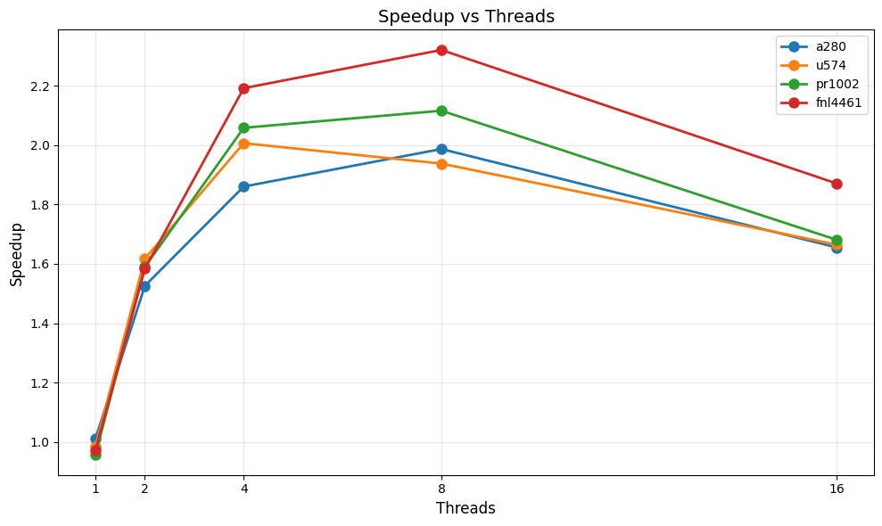

# Genetic Algorithm for the Traveling Salesman Problem

A **parallel implementation** of a **generational genetic algorithm** to solve the **Traveling Salesman Problem (TSP)**. The algorithm aims to find the shortest path that visits all cities exactly once and returns to the starting point.

## Features

- **Parallel execution** using thread pools for improved performance
- **Sequential mode** available for comparison and benchmarking
- Result visualization with Python scripts

## Project Structure
```
tsp-genetic-algorithm/
├── CMakeLists.txt          # Build configuration
├── README.md               # This file
├── .gitignore             # Git ignore rules
├── main.cpp               # Entry point
├── include/               # Header files
│   ├── tsp/              # TSP-specific components
│   ├── path/             # Path/tour representation
│   ├── ga/               # Genetic algorithm logic
│   ├── parallel/         # Parallelization (ThreadPool)
│   └── utils/            # Utils (e.g. Write results to CSV)
├── src/                  # Implementation files
│   ├── tsp/
│   ├── path/
│   ├── ga/
│   ├── parallel/
│   └── utils/
├── instances/            # TSPLIB problem instances (.tsp files)
├── notebooks/            # Analysis and plotting notebooks
├── results/              # Output directory for results
└── scripts/              # Automation scripts
```

## Requirements

- **C++17** compatible compiler (GCC 7+, Clang 5+, or MSVC 2017+)
- **CMake 3.15** or higher
- *(Optional)* Python 3.x for visualization

### Build Types

Release build (with optimizations):

```bash
mkdir build && cd build
cmake -DCMAKE_BUILD_TYPE=Release ..
make
```

Or for a debug build:

```bash
cmake -DCMAKE_BUILD_TYPE=Debug ..
make
```

## Usage

### Examples
```bash
# Run with default settings (parallel mode, default instance)
./tsp_ga

# Specify a TSP instance
./tsp_ga instances/berlin52.tsp

# Run in sequential mode
./tsp_ga -s instances/berlin52.tsp
./tsp_ga --sequential instances/eil51.tsp

# Profiling instance running with 8 threads
./tsp_ga instances/pr1002.tsp -t 8 -p
```

### Command-Line Arguments

| Flag | Long Form | Description | Example |
|------|------------|--------------|----------|
| `-s` | `--sequential` | Runs the algorithm in **sequential mode** (single thread). | `./tsp_ga -s instances/eil51.tsp` |
| `-t` | `--threads` | Sets the **number of threads** to use in parallel mode. | `./tsp_ga instances/pr1002.tsp -t 8` |
| `-P` | `--population` | Sets the **population size**, overwriting the configured value. | `./tsp_ga instances/a280.tsp -t 4 -P 200` |
| `-p` | `--profile` | Enables **profiling mode**, recording CPU and memory usage. | `./tsp_ga instances/pr1002.tsp -t 8 -p` |
| *(none)* | – | Runs in **parallel mode** with default parameters. | `./tsp_ga` |

### Output

#### Standard Execution:
The results of each run are saved in the file `results/data.csv`. This file contains performance metrics such as total time, best distance, and configuration parameters.

#### Profiling Mode:
When profiling is enabled with flag `-p`, the main result metrics are skipped, and only detailed CPU and memory usage data are recorded. in `results/profiles/`. Each profile is saved using the convention:

```bash
<instance>_profile_<mode>_<threads>.csv

# Example:
pr1002_profile_parallel_t8.csv
```

## TSP Instances

This project considers Euclidean distances in 2-D TSPLIB instances. Download instances from [TSPLIB](http://comopt.ifi.uni-heidelberg.de/software/TSPLIB95/) and place them in the `instances/` directory.

## Algorithm Parameters

Configure genetic algorithm parameters in `config.json`:
- Population size
- Tournament size
- Mutation rate
- Local Optimization (2-opt) rate
- Elite size
- Number of generations

## Visualization

### Results Notebook

The main notebook `results.ipynb` provides visual analysis of the algorithm’s performance metrics based on aggregated data in `results/data.csv`.

This notebook visualizes:

- **Threads × Speedup**: measures parallel performance gains
- **Threads × Efficiency**: evaluates resource utilization  
- **Overhead Bars**: compares sequential and parallel execution times

Below is an example of the speedup visualization generated by this notebook:




### Profiles Notebook

The **Profiles Notebook** analyzes the runtime behavior of each execution mode (sequential and parallel) by visualizing system resource usage over time.  
It reads the CSV files generated in `results/profiles/` and produces detailed plots for performance analysis.

This notebook provides:

- **CPU Usage Over Time**: shows how CPU utilization varies during execution for each thread configuration.
- **Memory Usage Over Time**: tracks memory consumption patterns across sequential and parallel runs.

> **Note:** To run the notebooks, install the Python dependencies listed in `requirements.txt` using:
> ```bash
> pip install -r requirements.txt
> ```


## References

- TSPLIB: http://comopt.ifi.uni-heidelberg.de/software/TSPLIB95/
- Thread Pool Pattern: https://www.geeksforgeeks.org/cpp/thread-pool-in-cpp/
